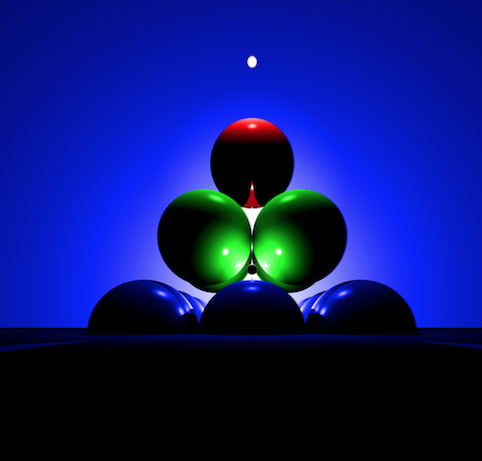
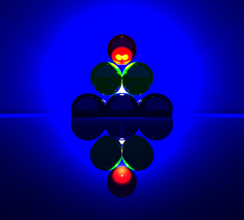
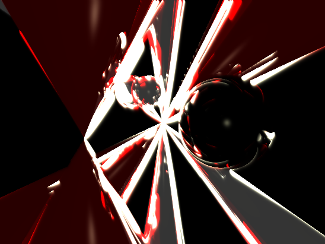
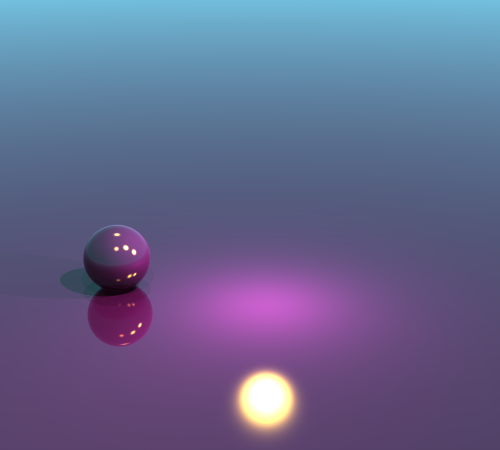

# Ray Tracer

This Ray Tracer is a port of the the ray tracer I did at school
It has been re written in C++ from its code written in C
 
I rewrote it in C++ because I plan to add some more advanced features than the C version has

# Current Features

It's able to trace 4 different shapes:
- plane
- sphere
- cylinder
- cone

2 types of light sources
- Direct light source
- Point light source

Effects
- Dithering 
- Sepia
- Greyscale

Reflections with n dimensions
 Anti Aliasing
 Multi Threaded Tracing

<b>Settings file to make changes without needing to recompile the program</b>

# To Run
Make sure you have GCC, and Make installed and configured on your machine

<b>make all</b>
 
`./RT <map file>`

# Preview
<b>This map file will produce the image below
 [MAP FILE](maps/pyro.map)

 
 
 
 

